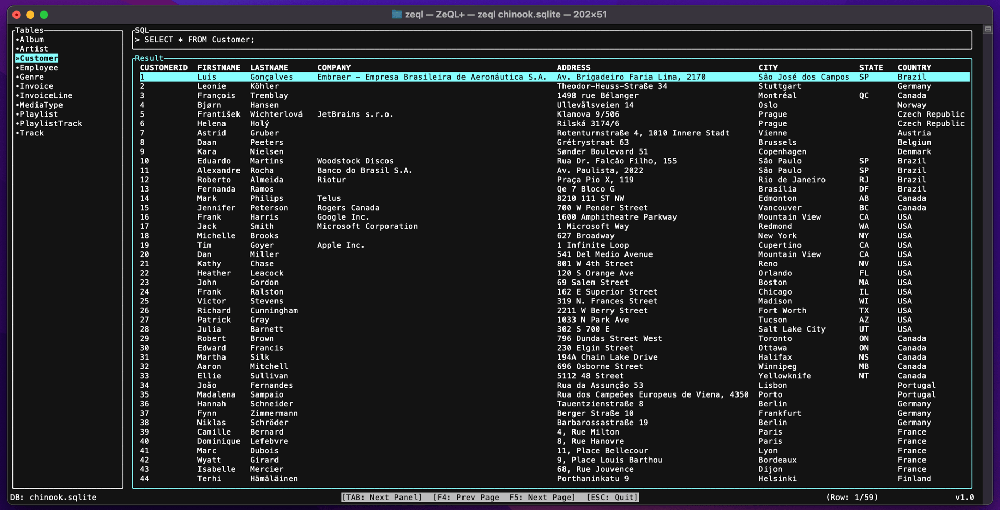
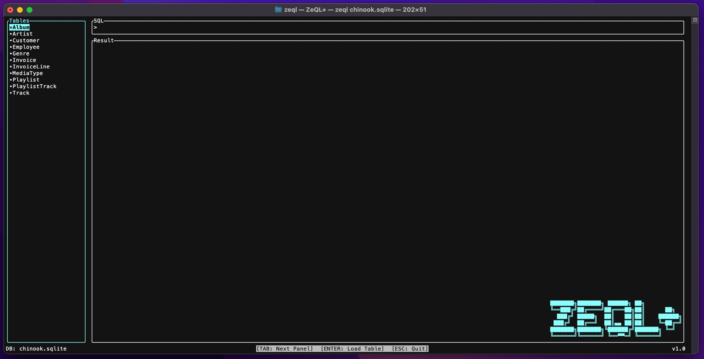
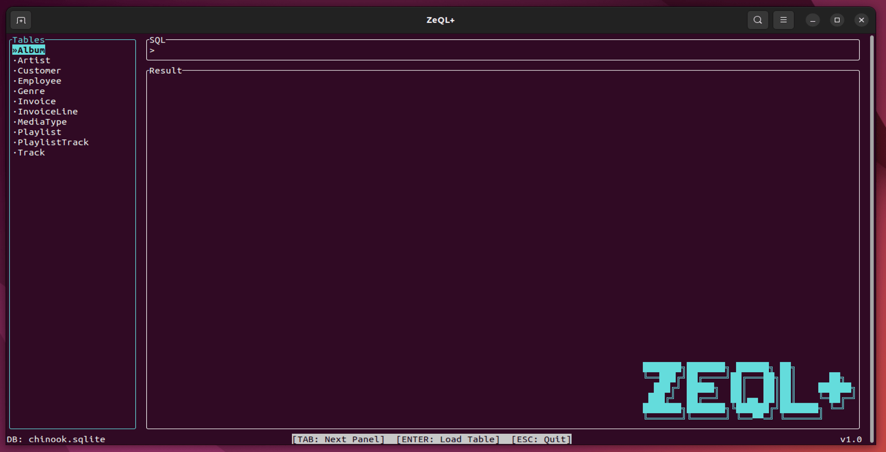
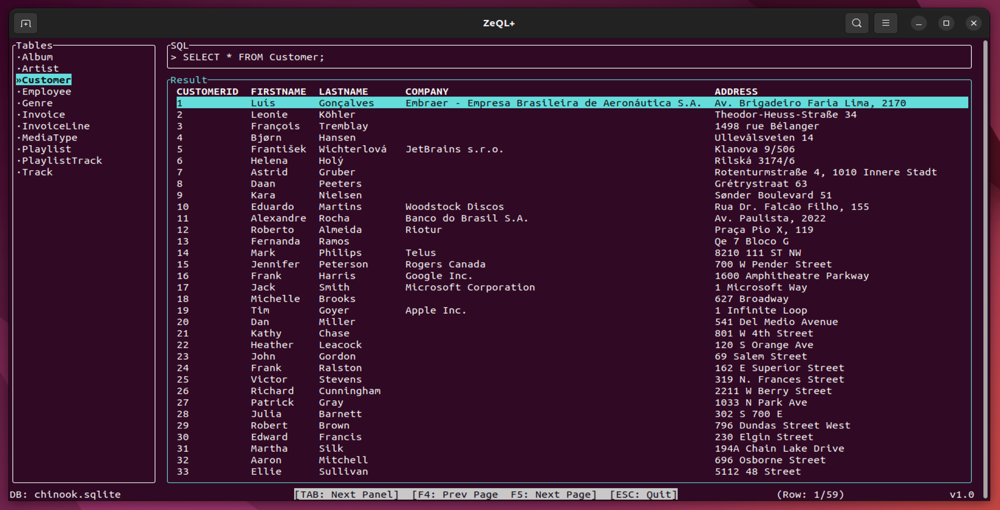
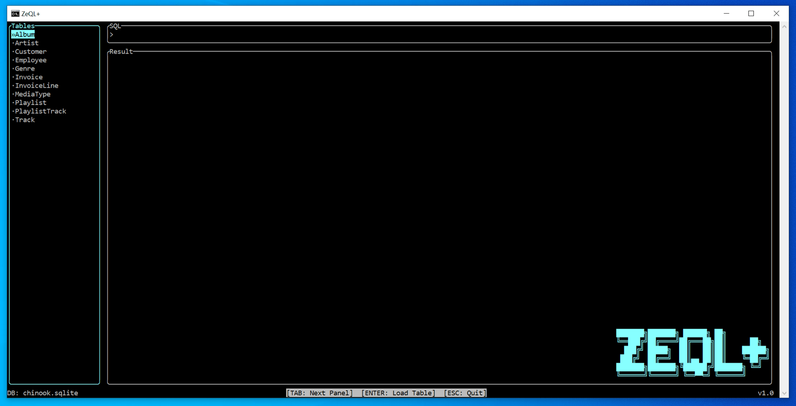
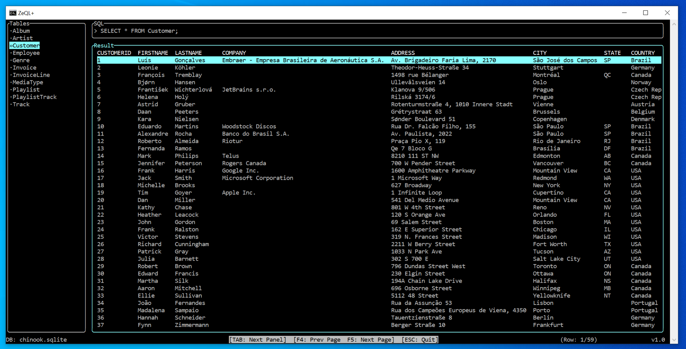

# ZeQL+ : Terminal SQLite Database Browser



## Features

- Open any SQLite database file
- Very fast
- Runs in a Terminal / CMD window
- Tiny executable with no dependencies
- List all tables in the database to browse
- Paginated view of table rows
- Run custom SQL queries and view the results
- Cross platform: macOS, Linux, Windows
- Open source

---

## Install

Pre-built binaries for macOS, Linux, Windows 10+ are available as zip files in the [releases](https://github.com/ZetloStudio/ZeQLplus/releases) page. Just extract and run directly with no need to install.

---

## How to use ZeQL+

From the command line in a Terminal / CMD window:

```shell
zeql <database_filename>
```

Note: you should move the `zeql` executable to a location in your path.

### Sample SQLite database

You can download a sample SQLite database to test the functionality of ZeQL+ here: [Chinook SQLite](https://github.com/lerocha/chinook-database/blob/master/ChinookDatabase/DataSources/Chinook_Sqlite.sqlite)

---

## Building from source

ZeQL+ is using [Vlang](https://github.com/vlang/v) v0.4.10 or above. To build ZeQL+ from source:

1. First you need to [install V](https://github.com/vlang/v#installing-v-from-source).
1. Clone the ZeQL+ repo
1. Build the executable in production mode

### macOS / Linux / Windows 10+

```shell
v -prod -skip-unused . -o zeql
```

---

## Screenshots

### macOS

- Startup
  

- Table Browser
  

### Linux

- Startup
  

- Table Browser
  

### Windows

- Startup
  

- Table Browser
  

---

## License

Licensed under [MIT](LICENSE)
